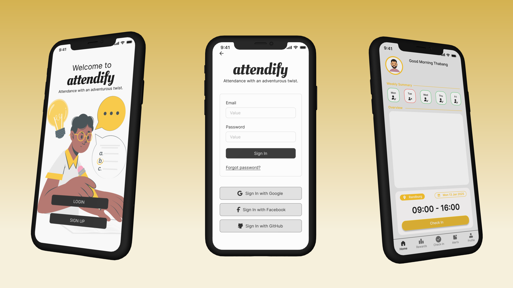

# Attendify

## Introduction
Attendify is a Web Attendance and Gamification System designed for XYZ School to streamline the attendance process and motivate students through gamification. The system allows students to check-in via a web application and provides various features for students, teachers, and administrators.



## User Requirements

### Students' Requirements
- Check-in for attendance using GPS, QR code, or a check-in button.
- Receive reminders for check-ins.
- View attendance history.
- Earn points and badges for good attendance.
- View rankings on leaderboards.
- Redeem points for rewards.
- Easy-to-use and navigate app.

### Teachers' Requirements
- Generate QR codes for class sessions.
- Monitor real-time attendance.
- Receive alerts about absent students.
- Adjust attendance records manually.
- Access attendance reports and analytics.

### Administrators' Requirements
- Manage user accounts.
- Configure system settings and schedules.
- Access comprehensive attendance analytics.
- Ensure compliance with data protection regulations.

### General Requirements
- Reliable app functionality during school hours.
- Quick response times.
- Secure and private data handling.
- Reflect school branding.
- Provide support and assistance.

## Software Requirements

### Core Functionalities
- User authentication and management.
- Student check-in methods: GPS, QR code, check-in button.
- Teacher dashboard for attendance monitoring and analytics.
- Notifications for students and teachers.
- Attendance reports and analytics.
- Gamification features: points, badges, leaderboards.
- Administrative functions for user and system management.

### Non-Functional Requirements
- Performance: Handle concurrent usage by up to 1,000 users.
- Security: Encryption for data in transit and at rest.
- Usability: Intuitive interface for users with varying technical proficiency.
- Reliability: 99.5% uptime during school hours.
- Maintainability: Modular architecture for updates and maintenance.
- Portability: Compatible with major web browsers.

## Tech Stack
- **Frontend**: React
- **Backend**: Django, Django Rest Framework
- **Azure Cloud**: Azure SQL, AzureStaticWebAPP

## Setup Instructions
1. Clone the repository:
  ```bash
   git clone https://github.com/oyamecodes/attendify.git
   cd attendify
  ```
   
2. Install frontend dependencies:
  ```bash
   cd frontend
   npm install react
  ```
3. Install backend dependencies:
  ```bash
  cd backend
  pip install -r requirements.txt
  ```
4. Run the development server:
  ```bash
  # Frontend
  cd frontend
  npm start
  
  # Backend
  cd backend
  python manage.py runserver
  ```
## Running the Application
- Open your web browser and navigate to http://localhost:3000 for the frontend.
- The backend API will be available at http://localhost:8000.

## Conclusion
Attendify aims to improve the attendance tracking process and motivate students through gamification. With its user-friendly interface and comprehensive features, the system caters to the needs of students, teachers, and administrators at XYZ Schoo
