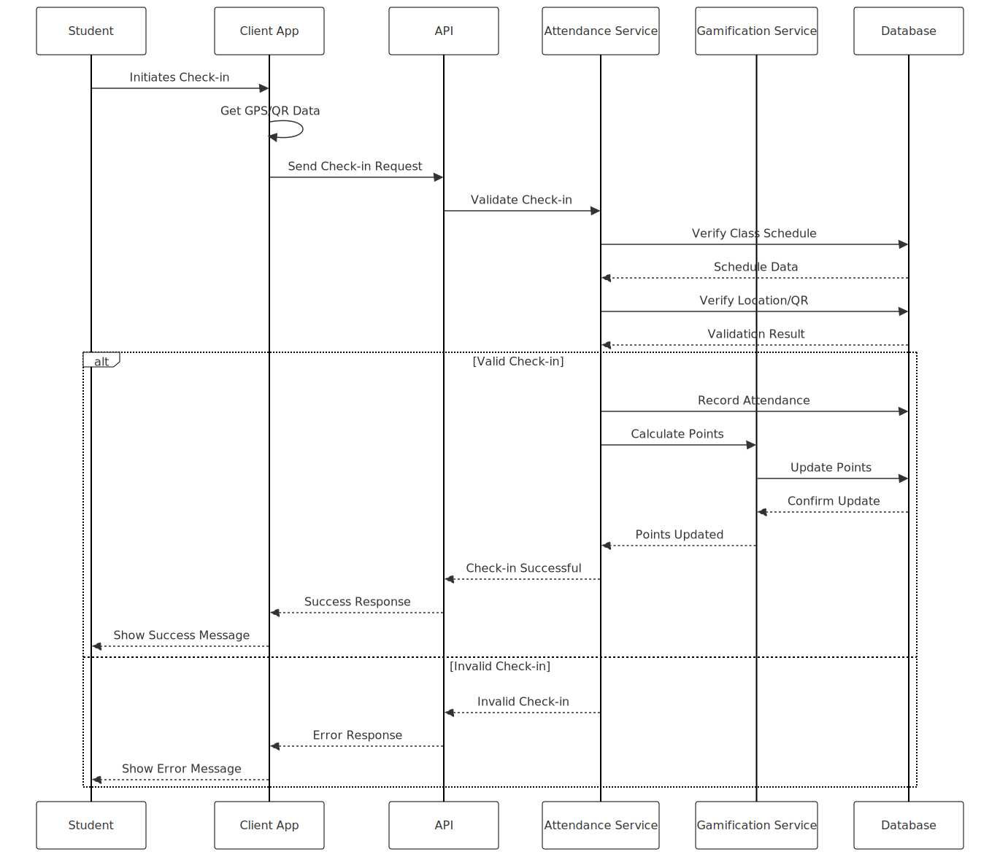
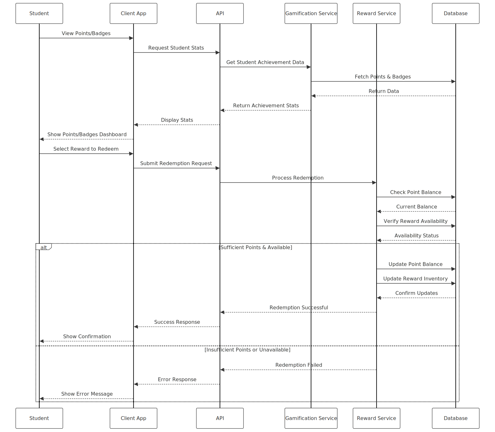
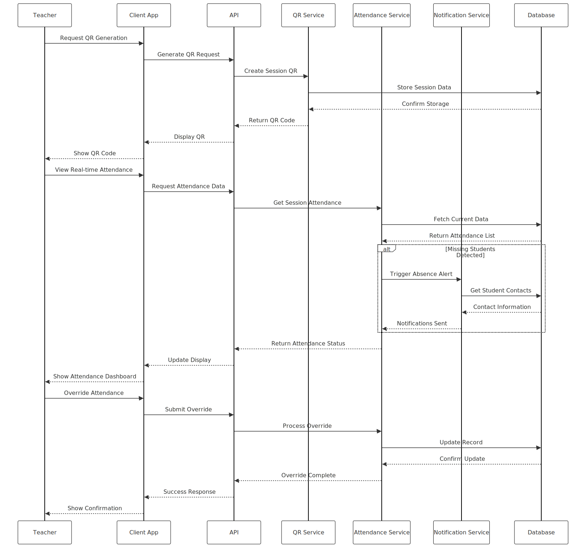
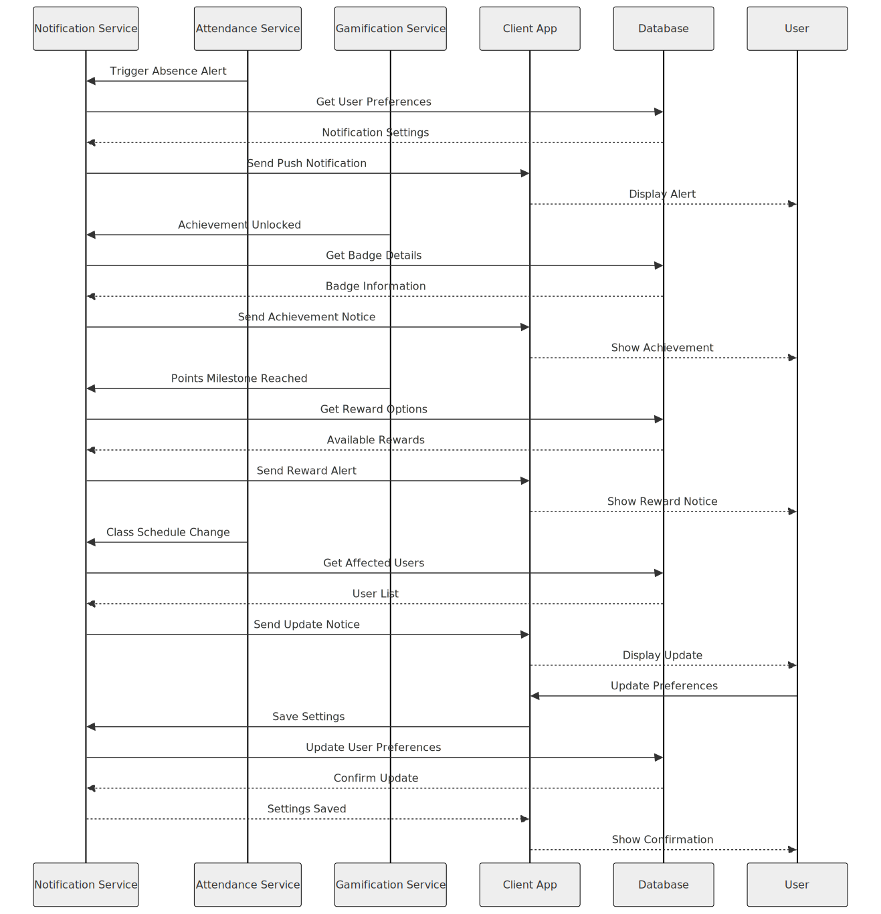

# Software Requirements Specification

## 1. Introduction

### 1.1 Purpose

The purpose of this Software Requirements Specification (SRS) document is to provide a detailed description of the Web Attendance and Gamification System for FMTALI. This document outlines the system's requirements to ensure a complete and comprehensive understanding of the project's goals and functionalities.

### 1.2 Scope

The Web Attendance and Gamification System is intended to streamline the attendance tracking process by allowing students to check-in via a web application. It introduces gamification elements to motivate students to attend classes regularly and on time.

### 1.3 Definitions, Acronyms, and Abbreviations

- **SRS**: Software Requirements Specification
- **URD**: User Requirements Document
- **GPS**: Global Positioning System
- **QR Code**: Quick Response Code
- **UI/UX**: User Interface/User Experience
- **LDAP**: Lightweight Directory Access Protocol
- **SSO**: Single Sign-On
- **CRUD**: Create, Read, Update, Delete
- **Django**: A high-level Python web framework
- **Django Rest Framework**: A powerful and flexible toolkit for building Web APIs
- **React**: A JavaScript library for building user interfaces
- **TailwindCSS**: A utility-first CSS framework
- **MaterialUI**: A popular React UI framework

### 1.4 References

- XYZ School Policies and Guidelines
- [Django Documentation](https://docs.djangoproject.com/)
- [Django Rest Framework Documentation](https://www.django-rest-framework.org/)
- [React Documentation](https://reactjs.org/docs/getting-started.html)
- [TailwindCSS Documentation](https://tailwindcss.com/docs)
- [MaterialUI Documentation](https://mui.com/getting-started/installation/)

### 1.5 Overview

This SRS provides a comprehensive overview of the system architecture, functionalities, user interfaces, and specific requirements. It serves as a blueprint for developers and stakeholders to ensure that the system meets all defined requirements.

## 2. Overall Description

### 2.1 Product Perspective

The Web Attendance and Gamification System is a new, independent application designed to replace the traditional paper-based attendance system. It integrates with the school's existing infrastructure and provides a modern solution for attendance tracking and student engagement.

### 2.2 Product Functions

The system provides the following core functionalities:

#### Student Functions:

- Check-in using GPS verification, QR code scanning, or a check-in button.
- View personal attendance records and statistics.
- Earn reward points and badges through consistent attendance.
- View leaderboards and redeem rewards.

#### Teacher Functions:

- Generate QR codes for class sessions.
- Monitor real-time attendance.
- Override or adjust attendance records.
- Access attendance analytics and reports.

#### Administrator Functions:

- Manage users (students, teachers).
- Configure system settings and schedules.
- Access global attendance analytics.

### 2.3 User Classes and Characteristics

- **Students**: Primary users who will use the web application to check-in and engage with gamification features. Varying levels of technical proficiency; UI must be intuitive.
- **Teachers**: Manage class attendance, monitor student participation. Require tools for oversight and analytics.
- **Administrators**: Oversee the entire system, manage data, and handle exceptional cases. Require access to all data and system configurations.

### 2.4 Operating Environment

- **Web Application**:
  - Compatible with modern web browsers (Chrome, Firefox, Safari, Edge).
  - Accessible on desktop and mobile devices.
- **Backend**:
  - Django and Django Rest Framework for backend services.

### 2.5 Design and Implementation Constraints

- Must adhere to privacy laws (e.g., FERPA, GDPR) regarding student data.
- Network connectivity required for real-time features; offline support limited.
- Performance must be optimized for devices with varying hardware capabilities.
- Must use Django and Django Rest Framework for the backend, and React, TailwindCSS, and MaterialUI for the frontend.

### 2.6 Assumptions and Dependencies

- Users have access to compatible devices.
- Internet connectivity is available within the school premises.
- School administration supports and enforces the use of the application.
- Integration with existing school systems is limited or provided via APIs.

## 3. Specific Requirements

### 3.1 Functional Requirements

#### 3.1.1 User Authentication and Management

- **FR1**: The system shall allow users to register and log in using email and password.
- **FR2**: The system shall support role-based access control (Student, Teacher, Admin).
- **FR3**: The system shall verify user emails during registration.
- **FR4**: Users shall be able to reset their passwords securely.

#### 3.1.2 Student Check-In

- **FR5**: Students shall be able to check-in using GPS verification.
  - **FR5.1**: The system shall verify if the student's device is within the predefined geofence of the classroom.
- **FR6**: Students shall be able to check-in by scanning a QR code generated by the teacher.
  - **FR6.1**: The system shall validate the QR code's authenticity and validity.
- **FR7**: Students shall be able to check-in using a check-in button during class time.
  - **FR7.1**: The system shall ensure the button is only active during scheduled class times.

#### 3.1.3 Teacher Dashboard

- **FR8**: Teachers shall be able to generate dynamic QR codes for each class session.
- **FR9**: Teachers shall have real-time access to attendance records for their classes.
- **FR10**: Teachers shall be able to manually override or adjust attendance records.
- **FR11**: Teachers shall have access to attendance analytics and trends for their classes.

#### 3.1.4 Notifications and Alerts

- **FR12**: The system shall send push notifications to students who have not checked in.
- **FR13**: The system shall alert teachers about absent students at the start of the class.
- **FR14**: Users shall be able to configure notification preferences.

#### 3.1.5 Attendance Reports

- **FR15**: The system shall provide visual dashboards displaying attendance statistics.
- **FR16**: Users shall be able to export attendance reports in PDF and Excel formats.

#### 3.1.6 Gamification Features

- **FR17**: The system shall award points to students for timely attendance.
- **FR18**: The system shall award bonus points for consecutive on-time check-ins.
- **FR19**: The system shall deduct points for late check-ins or unexcused absences.
- **FR20**: The system shall display leaderboards by class, grade, and overall school rankings.
- **FR21**: The system shall award achievement badges based on predefined criteria.
- **FR22**: Students shall be able to view and display their badges on their profiles.
- **FR23**: Students shall be able to redeem points for in-app rewards and recognitions.

#### 3.1.7 In-App Rewards Store

- **FR24**: The system shall provide a rewards store where students can redeem points.
- **FR25**: Rewards may include access to events, discounts, and virtual items.
- **FR26**: The system shall manage inventory and availability of rewards.

#### 3.1.8 Administrative Functions

- **FR27**: Administrators shall be able to manage users, including creating, updating, and deleting accounts.
- **FR28**: Administrators shall be able to configure system settings and class schedules.
- **FR29**: Administrators shall have access to global attendance analytics and reports.

### 3.2 Data Requirements

- **DR1**: The system shall store user data securely, including personal information and authentication credentials.
- **DR2**: Attendance records shall include student ID, class ID, date, time, check-in method, and location data (if applicable).
- **DR3**: Gamification data, including points, badges, and leaderboards, shall be accurately maintained.

### 3.3 Interface Requirements

#### 3.3.1 User Interface

- **UIR1**: The application shall have an intuitive and user-friendly interface.
- **UIR2**: The UI shall be consistent across different platforms (desktop and mobile).
- **UIR3**: The application shall support the school's branding, including colors and logos.
- **UIR4**: Accessibility features such as scalable fonts and high-contrast modes shall be available.

#### 3.3.2 Hardware Interface

- **HIR1**: The application shall interface with device GPS and camera functionalities.
- **HIR2**: The application shall handle permissions for location and camera access appropriately.

#### 3.3.3 Software Interface

- **SIR1**: The system shall interface with Django and Django Rest Framework for backend functionalities.
- **SIR2**: The application may integrate with existing school systems via APIs if required.

### 3.4 Non-Functional Requirements

#### 3.4.1 Performance Requirements

- **NFR1**: The system shall handle concurrent usage by up to 1,000 users without performance degradation.
- **NFR2**: Attendance check-in transactions shall be processed within 2 seconds under normal network conditions.

#### 3.4.2 Security Requirements

- **NFR3**: The system shall enforce encryption for data in transit and at rest.
- **NFR4**: The system shall comply with relevant data protection regulations (e.g., FERPA, GDPR).
- **NFR5**: Access to data shall be controlled based on user roles.

#### 3.4.3 Usability Requirements

- **NFR6**: The application shall be usable by individuals with basic computer proficiency.
- **NFR7**: The system shall provide helpful error messages and guidance when users encounter issues.

#### 3.4.4 Reliability Requirements

- **NFR8**: The system shall have an uptime of 99.5% during school hours.
- **NFR9**: Data loss in case of system failure shall not exceed the last transaction.

#### 3.4.5 Maintainability Requirements

- **NFR10**: The system shall be built using modular architecture to facilitate updates and maintenance.
- **NFR11**: Documentation of code and system functionalities shall be maintained.

#### 3.4.6 Portability Requirements

- **NFR12**: The web application shall be compatible with major web browsers.

## 4. Appendices

### Appendix A: User Interface Mockups

Illustrates the proposed user interface designs for the student, teacher, and admin interfaces.

### Appendix B: System Architecture Diagram

Illustrates the high-level architecture of the system, including the frontend, backend, and database components.

### Appendix C: Use Case Diagrams

Illustrates the main interactions between different types of users (Student, Teacher, Admin) and the system functionalities.

### Appendix D: Class Diagrams

Represents the main data structures and their relationships, showing how different entities in the system are connected.

### Appendix E: Sequence Diagrams

#### Student Check-In Sequence

Demonstrates the flow of the check-in process, which is one of the core functionalities of the system.

#### Student Points and Rewards Sequence

Shows how students interact with the gamification system, including viewing points/badges and redeeming rewards.

#### Teacher QR Generation and Monitoring Sequence

Illustrates the process of generating QR codes for attendance and monitoring student attendance in real-time.

#### Administrator Functions Sequence

Demonstrates the flow of administrative tasks including user management, system configuration, and global reporting.

#### Notification System Sequence

Shows how different types of notifications are triggered, processed, and delivered to users.

#### Reports and Analytics Sequence

Illustrates how the system generates various reports and analytics for different user roles.

